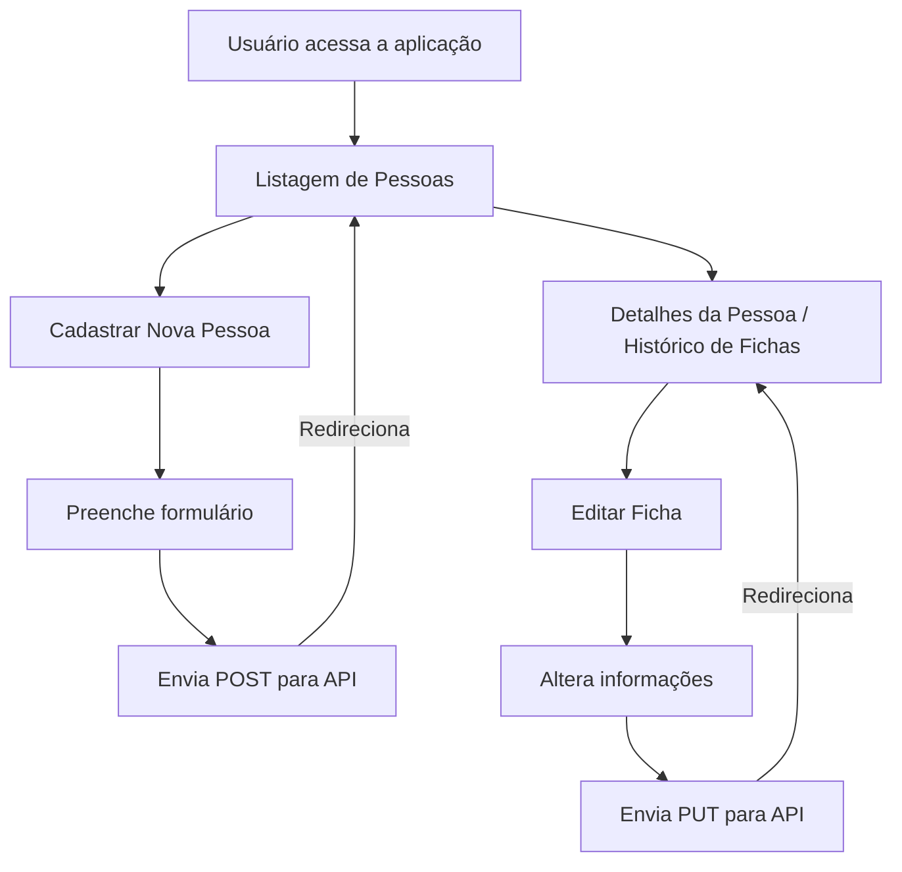
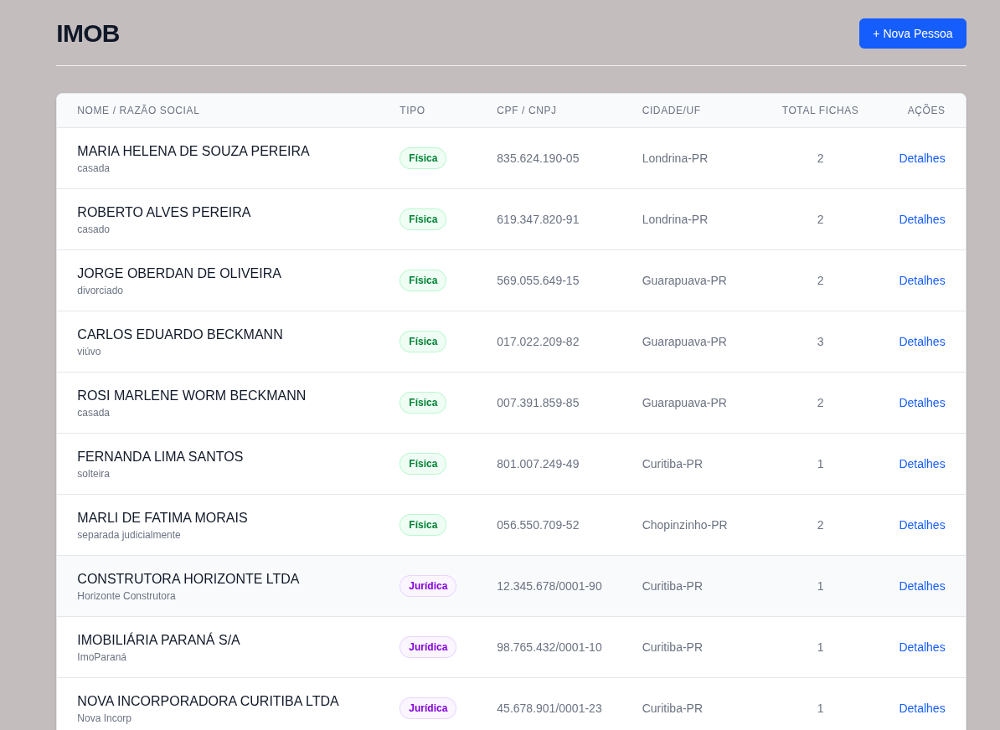
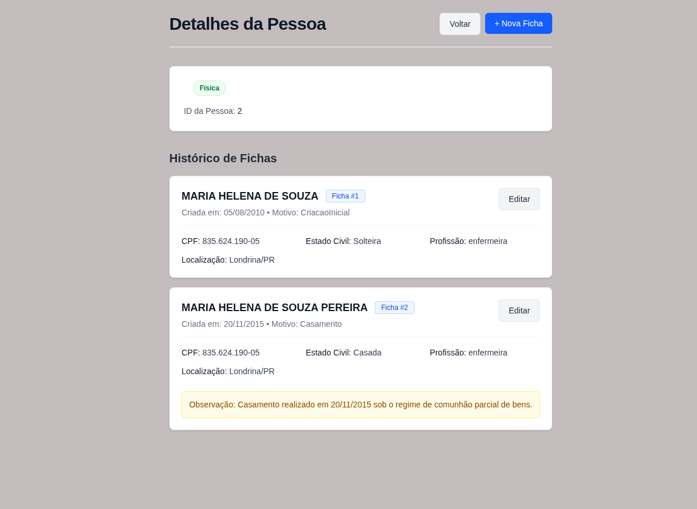
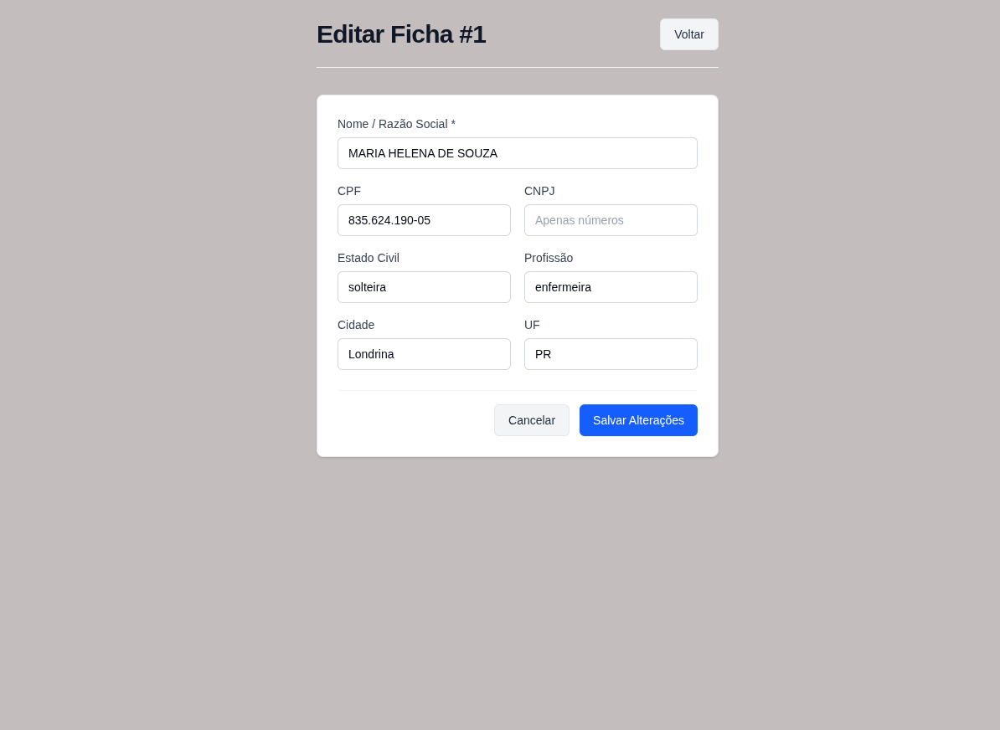
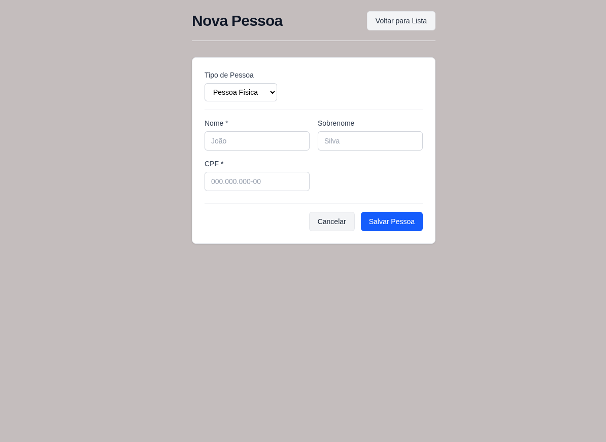

## 1. Sobre o Projeto

Desenvolvimento de uma aplicação front-end com next para gerenciamento de pessoas e fichas cadastrais, consumindo uma API.

## 2. Tecnologias e Dependências

- **[x] NextJs:** utilizado na estrutura da aplicação e no roteamento. Também foi utilizado para busca de dados no servidor com os servers components e o axios
- **[x] ReactJs:** para a construção da interface e componentes.
- **[x] Typescript:** utilizado na tipagem do swagger da API principalmente.
- **[x] Axios:** utilizei o cliente http axios principalmente para centralizar a URL da api em um só lugar, invés de colocar em todas as requisições. Fazer o parse para JSON automaticamente.
- **[x] React Hook Form:** Melhorar a performance da aplicação exigindo menos re-renderizações a cada valor digitado no input dos forms. Deixar o código mais limpo, diminuindo o uso de useState para cada input. Validação dos dados mais fácil com a biblioteca Zod.
- **[x] Zod:** utilizado para validar campos do formulário sem preciasar ficar utilizando vários if's. Centralizar as mensagens de erro e mostrar as mensagens ao usuário dizendo o que ele errou e aonde. Não permitir requisições ao servidor caso os dados estejam incorretos.
- **[x] Tailwind:** utilizado na estilização.

## 3. Estrutura do Projeto

```text
src/
├── app/
│   ├── pessoas/
│   │   ├── [id]/
│   │   │   ├── fichas/
│   │   │   │   └── [fichaId]/
│   │   │   │       └── edit/
│   │   │   │           └── page.tsx
│   │   │   └── page.tsx
│   │   ├── nova/
│   │   │   └── page.tsx
│   │   └── page.tsx
│   ├── globals.css
│   ├── layout.tsx
│   └── page.tsx
│
├── components/
│   ├── layout/
│   │   └── PageHeader.tsx
│   ├── pessoa/
│   │   ├── FichaForm.tsx
│   │   ├── PessoaForm.tsx
│   │   ├── PessoaRow.tsx
│   │   ├── PessoaTable.tsx
│   │   └── PessoaTipoBadge.tsx
│   └── ui/
│       ├── Button.tsx
│       ├── ErrorMessage.tsx
│       ├── Inputs.tsx
│       └── Loading.tsx
│
├── services/
│   ├── api.ts
│   └── pessoas.ts
│
└── types/
    └── pessoa.ts
```

- **app:** roteamento baseado em arquivos baseado no App Router do Next, rotas dinâmicas e renderização da aplicação.
- **components:** centraliza a construção da ui com componentes. Está separada em partes puramente visual(ui e layout) e em componentes de domínio de negócio(pessoas).
- **services:** criada para isolar a comunicação http da aplicação. Centraliza a configuração do cliente e agrupa funções de acesso[`listarPessoas(), obterPessoa(), criarPessoa()`]

## 4. Fluxo da Aplicação



## 5. Telas

 ### Tela Home


- Arquivos utilizados para a contrução da tela:
```text
src/
├── app/
│   ├── globals.css
│   ├── layout.tsx
│   └── page.tsx
│
├── components/
│   ├── layout/
│   │   └── PageHeader.tsx
│   ├── pessoa/
│   │   ├── PessoaTable.tsx
│   └── ui/
│       ├── Button.tsx
│       ├── ErrorMessage.tsx
│       ├── Inputs.tsx
│       └── Loading.tsx
│
├── services/
│   └── pessoas.ts
```

**Explicação:** utilizei um server component assíncrono para ser renderizado somente após a função `listarPessoas()` terminar. Essa função esta presente no arquivo `pessoas.ts`e é responsável por consumir a API e retornar os dados responsáveis pela listagem. Como é um server component, o usuário já recebe a página pronta. Deixei o revalidate como 0 para a página não ser armazenada em cache em nenhum momento, isso para garantir que o usuário sempre veja os dados atualizados na tela e nenhum dado defasado. Utilizei o tratameto de erros try/catch caso a API não responda. Utilizei os componentes para enxugar a tela principal. Praticamente toda a tela deu pra fazer com componentes.

### Tela de detalhes da pessoas



- Arquivos utilizados para a contrução da tela:
```text
src/
├── app/
│   ├── pessoas/
│   │   ├── [id]/
│   │   │   └── page.tsx
│   ├── globals.css
│   ├── layout.tsx
├── components/
│   ├── layout/
│   │   └── PageHeader.tsx
│   ├── pessoa/
│   │   └── PessoaTipoBadge.tsx
│   └── ui/
│       ├── Button.tsx
│       ├── ErrorMessage.tsx
├── services/
│   └── pessoas.ts

```
**Explicação:** utilizando rotas dinâmicas para listar o histórico de fichas de determinado id. O Next extrai o valor o valor da URL e disponibiliza em params. O params é uma promise por isso é feito o `await params` antes de ler o ID. O Next é impedido de guardar a página em cache novamente. Usei renderizações condicionais para mostrar somente os dados que estão disponíveis na API.

### Tela de editar ficha



- Arquivos utilizados para a contrução da tela:
```text
src/
├── app/
│   ├── pessoas/
│   │   ├── [id]/
│   │   │   ├── fichas/
│   │   │   │   └── [fichaId]/
│   │   │   │       └── edit/
│   │   │   │           └── page.tsxf
│   ├── globals.css
│   ├── layout.tsx
│   └── page.tsx
│
├── components/
│   ├── layout/
│   │   └── PageHeader.tsx
│   ├── pessoa/
│   │   └── PessoaTipoBadge.tsx
│   │   └── FichaForm.tsx
│   └── ui/
│       ├── Button.tsx
│       ├── ErrorMessage.tsx
|       ├── Inputs.tsx
|
├── services/
│   └── pessoas.ts

```
**Explicação:** o componente tem que interceptar duas promisses agora, o id da pessoa e da ficha. Este server component faz a busca dos dados na API e depois injeta eles no client component ` <FichaForm/>`pela propriedade `fichaInicial`, assim o form já aparece preenchido. Tratamento de exceção caso o usuário tente acessar um ID de ficha que não exista.

### Tela de adicionar pessoa



- Arquivos utilizados para a contrução da tela:
```text
src/
├── app/
│   ├── pessoas/
│   │   ├── nova/
│   │   │   └── page.tsx
│   │   └── page.tsx
│   ├── globals.css
│   ├── layout.tsx
│   └── page.tsx
│
├── components/
│   ├── layout/
│   │   └── PageHeader.tsx
│   ├── pessoa/
│   │   ├── PessoaForm.tsx
│   └── ui/
│       ├── Button.tsx

```
**Explicação:** está página está abrigando basicamente somente o layout, deixando o trabalho para os componentes. No `<PessoaForm/>` utilizei o `Reac Hook Form` para gerenciar os estados dos inputs e o `Zod` para validações de regras antes de enviar dados para a API
